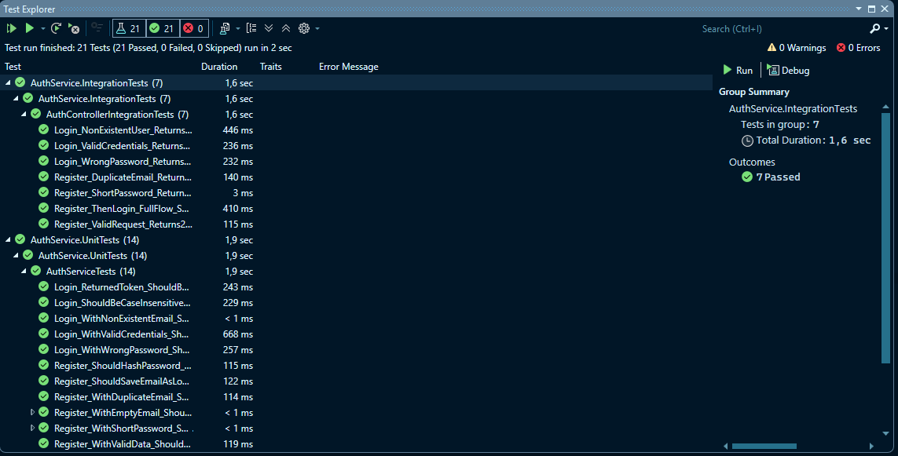
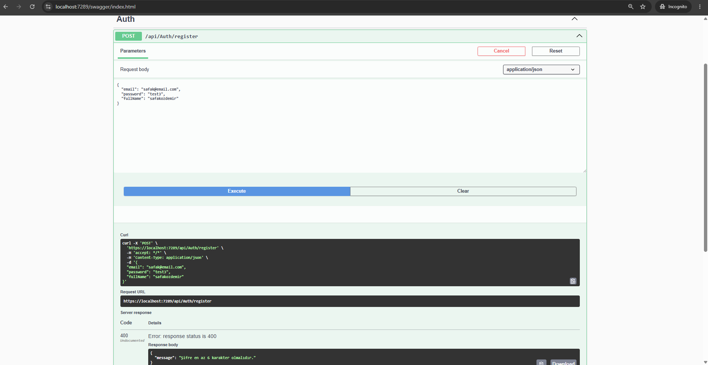

# 🧪 AuthService.Testing — Unit & Integration Tests

JWT tabanlı kullanıcı kayıt/giriş servisinin xUnit ile yazılmış Unit ve Integration testleri.

## Teknolojiler
- .NET 9 Web API
- xUnit + FluentAssertions + Moq
- WebApplicationFactory (Integration testler)
- EF Core InMemory
- BCrypt şifre hashleme + JWT

## Testler (21 adet)
- **14 Unit Test:** Servis katmanı — kayıt validasyonları, duplicate email, şifre hashleme, JWT üretimi, case-insensitive email
- **7 Integration Test:** Gerçek HTTP istekleriyle endpoint testleri — status kodları, tam kayıt→login akışı

## Ekran Görüntüleri

### Test Sonuçları (21/21 ✅)


### Swagger UI — Validasyon Örneği


## Çalıştırma
```bash
dotnet test
```

## Not
Testler sayesinde **Türkçe locale bug'ı** yakalandı: `ToLower()` Türkçe sistemlerde `I → ı` (noktasız) dönüşümü yaptığı için email eşleşmesi bozuluyordu. Çözüm: `ToLowerInvariant()`.